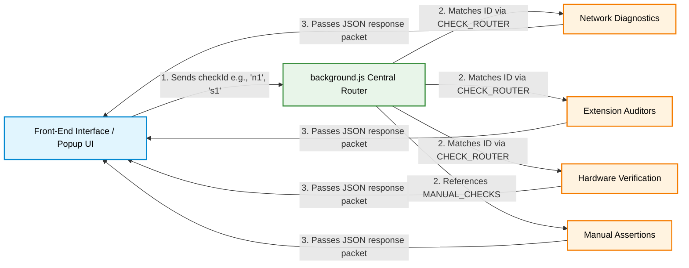

# exam security audit tool (ESAT)
A pre-examination security auditing and compliance verification in CBT(Computer Based Testing) environments. A vulnerability scanner for invigilators and technicians to ensure a complete cut-off of computer system from external Networks or Connections.

**Runs fully offline** — no data ever leaves the device.

## Installation Guidelines

1. Download all source code files (i.e. Background.js , manifest.json , popup.css , popup.html and popup.js) and Save them in a Single folder, naming it as (`exam-audit-extension`).
2. Open Chrome and go to `chrome://extensions`
3. Enable **Developer mode** (toggle option on top right)
4. Click **Load unpacked**
5. Select this folder (`exam-audit-extension`)
6. The shield icon appears in your toolbar , pin it for easy access

## Architecture

The project is split into a front-end UI layer and a background service worker. Below is a live diagram showing how data passes between your user interface and the background controller:

**background.js:** Runs as a background processing. It handles the core operational logic via an optimized dictionary router (CHECK_ROUTER) and a unified network probing helper (ping), returning clean, easily understandable status data directly to the viewport.

**UI Component:** Sequentially triggers security tests in sequences, listening for background callbacks to update system indicators in real time.

**What it checks ?**
18 checks across 5 domains as follows...
### Network & Connectivity
| # | Check | Method |
|---|-------|--------|
| N1 | Internet connectivity blocked | Attempts to fetch google.com , Result is 'fail' if internet is live |
| N2 | No external tabs open | Scans all open tabs for non-local URLs |
| N3 | Local exam server reachable | Pings 192.168.1.10 (configurable) |
| N4 | AI/external domains DNS-blocked | Attempts to fetch ChatGPT, Gemini endpoints |

### System & OS Integrity
| # | Check | Method |
|---|-------|--------|
| S1 | No remote desktop extensions | Scans installed extensions for AnyDesk, TeamViewer, RDP keywords |
| S2 | No screen recording extensions | Scans for OBS, Loom, Screencastify, Bandicam keywords |
| S3 | No clipboard sync extensions | Scans for cross-device clipboard tools |
| S4 | No AI-assist extensions | Scans for GPT, Copilot, Grammarly AI |
| S5 | Chrome version current | Reads Chrome version from user agent |
| S6 | USB storage locked | Advisory, verify this check physically |

### Exam Software
| # | Check | Method |
|---|-------|--------|
| SW1 | Kiosk/fullscreen mode | Checks window count and fullscreen mode |
| SW2 | Local server SSL valid | HTTPS fetch to local server |
| SW3 | Question paper checksum | Advisory, must be verified in exam software |
| SW4 | AI chatbot sites blocked | Attempts connections to 4 AI domains |
| SW5 | Browser version logged | Records Chrome version for audit trail |

### Hardware & Peripherals
| # | Check | Method |
|---|-------|--------|
| H1 | Webcam detected | `navigator.mediaDevices.enumerateDevices()` |
| H2 | Bluetooth state | Advisory, verify in OS Device Manager |

### Venue & Physical
| # | Check | Method |
|---|-------|--------|
| V1 | Signal jammer status | Advisory — physical confirmation required |

---

  ### Details to create Reports :

Click the ⚙ gear icon in the popup to set:
- **Exam server IP** — default to be set
- **Exam name** — Name of the Exam
- **Room / Lab ID** — for the report
- **Exam type** — CBT, OMR, or Hybrid

Settings are saved locally in `chrome.storage.local`.

---

## Exporting the audit report

After a scan, click **Export** to download a `.txt` report containing:
- Full results for every check with pass/fail/warn status
- Timestamped audit log
- Invigilator and superintendent sign-off section

## Permissions required by extension :

| Permission | Why needed |
|-----------|-----------|
| `tabs` | Check for external URLs open in any tab |
| `management` | List installed extensions to detect remote-access/AI tools |
| `system.cpu/memory/display` | System health metdata in the report |
| `processes` | Detect background processes  |
| `storage` | Save centre/exam settings locally |
| `scripting` | Run content checks on tabs |
| `host_permissions` (192.168.*) | Ping the local exam server |

---

## Limitations & advisory checks

Some checks (USB lock, Bluetooth, signal jammer) cannot be verified via browser
APIs and are flagged as **advisory** (WARN) requiring physical or OS-level confirmation.
For deeper OS leveled checks, this can be combined with the companion Python audit script in future.

---

## Possible advancements in this tool :

- [ ] Whitelist of approved extension IDs per board (NTA/CBSE configurable)
- [ ] Automatic re-scan every N minutes during exam.
- [ ] Companion Python script for OS-leveled process and port checks
- [ ] PDF report generation with digital signature support
- [ ] Multi-seat dashboard for centre superintendent
